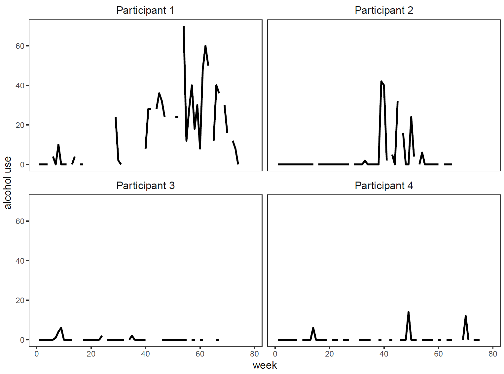

```{r setup, include=FALSE}
knitr::opts_chunk$set(message = F, warning = F)
```

This tutorial introduces the regime-switching zero-inflated multilevel Poisson (RS-ZIMLP) model, which is developed to accommodate zero inflation (ZI) in multi-subject count time series data.

Reference:

Li, Y., Oravecz, Z., Zhou, S., Bodovski, Y., Barnett, I.J., Chi, G., Zhou, Y., Friedman, N.P., Vrieze, S.I., & Chow, S.-M. (2022). Bayesian Forecasting with a Regime-Switching Zero-Inflated Multilevel Poisson Regression Model: An Application to Adolescent Alcohol Use with Spatial Covariates. *Psychometrika, 87*(2), 376-402, DOI: [10.1007/s11336-021-09831-9](10.1007/s11336-021-09831-9).


## Background 

Four randomly selected participants' self-reported weekly alcohol use data in the Colorado Online Twin Study (CoTwins). 

{width=50%}

Challenges in forecasting alcohol use:

- zero-inflation in time series data
- transitions between drinking and non-drinking regimes
- importance of quantifying the uncertainty around prediction results

## Related Works

ZIP models (e.g., [Lambert, 1992](10.1080/00401706.1992.10485228); [Böhning, 1998](https://doi.org/10.1002/(SICI)1521-4036(199811)40:7<833::AID-BIMJ833>3.0.CO;2-O)) assume that data are from a mixture of a Poisson distribution and a degenerate distribution at zero.

ZIP models with random effects (e.g., [Hall, 2000](https://doi.org/10.1111/j.0006-341X.2000.01030.x); [Min & Agresti, 2005](https://doi.org/10.1191/1471082X05st084oa)) were developed to analyze repeated measures of zero-inflated count data.

ZIP models have been extended further to accommodate time dependencies between observations in time series data (e.g., [Yang, 2012](https://doi.org/10.1177/0962280210387525)).

However, most of them focused on incorporating such time dependency in the Poisson part, not in the ZI part. In alcohol use dynamics, the probability of being in a certain regime may be dependent on the previous regime. The transitions between regimes can be captured in the ZI part to provide more information for forecasting.

## The Proposed Model

The model assumes that the distribution of the variable of interest ($Y_{i,t}$) given the previous regime ($S_{i,t-1}$) is a mixture of a Poisson distribution and a degenerate distribution at zero.

\begin{align}\tag{1}
    &Y_{i,t}|S_{i,t-1}=s =
    \begin{cases}
    0, & \text{with probability} \; 1-p_{1s,i,t} \\
    \text{Poisson}(\lambda_{i,t}), & \text{with probability} \; p_{1s,i,t} 
    \end{cases}
\end{align}


In the Poisson part, log means ($\eta_{i,t}$) are represented using a multilevel AR-X model.

$$\eta_{i,t} = \text{log}(\lambda_{i,t})$$

\begin{equation}\tag{2a}
   \eta_{i,t} = \phi_{0,i} + \phi_1 (\eta_{i,t-1} - \phi_{0,i}) + \mathbf{x}_{i,t-1}^T \mathbf{\beta} + \epsilon_{i,t},
   \epsilon_{i,t} \sim N(0, \sigma^2_{\epsilon})
\end{equation}

\begin{equation}\tag{2b}
\eta_{i,1} \sim N(\mu_{\eta_1}, \sigma^2_{\eta_1})
\end{equation}

\begin{equation}\tag{3}
    \phi_{0,i} = \mathbf{g}_{i}^T \mathbf{\gamma} + v_i, \; v_i \sim N(0, \sigma^2_v).   
\end{equation}

In the ZI part, within-individual transitions across regimes are modeled as a first-order Markov process conforming to a logistic regression model.

\begin{equation}\tag{4a}
    p_{rs,i,t} = P(S_{i,t} = r|S_{i,t-1} = s) = \frac{\exp(\mathbf{z}^T_{i,t-1}\mathbf{\alpha}_{rs})}{ \exp(\mathbf{z}^T_{i,t-1}\mathbf{\alpha}_{0s}) + \exp(\mathbf{z}^T_{i,t-1}\mathbf{\alpha}_{1s}) }, 
\end{equation}

where $S_{i,t}$ is a latent (i.e., unknown) person- and time-specific regime indicator; $r$ and $s$ are indices for the regime at time $t$ and $t-1$, which take on the value of 0 or 1, corresponding to the ZI and Poisson process, respectively. 

The initial regime probability is defined as:

\begin{equation}\tag{4b}
    p_{1,i,1} = P(S_{i,1} = 1) = \frac{\exp(\mathbf{h}^T_{i}\mathbf{\pi})}{ 1 + \exp(\mathbf{h}^T_{i}\mathbf{\pi}) } 
\end{equation}

Solving the predictive distributions of $Y_{i,t}$ and $S_{i,t}$ analytically involves solving high-dimensional integrals. Using Bayesian methods, we can obtain samples from their posterior predictive distributions and calculate pertinent summary statistics accordingly. The forecast uncertainty can also be quantified by calculating standard deviations of relevant posterior samples. 


## JAGS Code Example

The model was fitted using JAGS ([Plummer et al., 2003](https://www.r-project.org/conferences/DSC-2003/Drafts/Plummer.pdf)) through interfaces in R (i.e., rjags package; [Plummer et al., 2019](https://cran.r-project.org/web/packages/rjags/rjags.pdf)).

First, load libraries and simulated data. There is 30\% missingness in the dependent variable (`Y_obs`) and two covariates (`X_obs`).


```{r}
library(rjags)
source("postcalc.R")
load("SimulatedData_RSZIMLP_moderate_N200T60_1.Rdata")
dim(Y_obs) # dependent variable: 200 subjects x 60 time points
dim(X_obs) # 200 subjects x 60 time points x 2 covariates
```

Since we would like to predict the last observation for each subject, we first set them to `NA` before passing data into JAGS.

```{r}
Y = Y_obs[1:100,]
Y[,dim(Y)[2]] = NA
jags_data <- list(Y = Y, 
                  P = dim(Y)[1], # number of subjects 
                  maxT = dim(Y)[2], # maximum number of time points across subjects
                  X = X_obs, 
                  K = 1) # K is the length of the forecast window

```

Then it comes to the key component of this tutorial, i.e., the JAG script, which basically consists of two parts: model specifications (or likelihood functions) and prior specifications. 

```{r}
modelString = "
model{
  for (pp in 1:P) {
    
    ############# Equation 3
    
    intercept[pp] ~ dnorm(int0, tau_int)

    ##---------------------------- 1st observation --------------------------------------
    
    ############# Equation 1
    # Y ~ Poisson(exp(eta)) when midx = 2
    # Y = 0 when midx = 1
    
    Y[pp,1] ~ dpois((midx[pp,1]-1)*exp(eta[pp,1])+0.00001)
    
    ############# Equation 2b
    
    eta[pp,1] ~ dnorm(0,0.01)
    
    ############# Equation 4b
    
    # Odds ratio 
    odds[pp,1,1] <- 1
    odds[pp,1,2] <- exp(pi0)
    
    # Regime indicator
    midx[pp,1]~dcat(odds[pp,1,])
    
    ############# Covariate istribution
    
    X[pp,1,1] ~ dnorm(0,0.01)
    X[pp,1,2] ~ dnorm(0,0.01)
    
    ##---------------- Iterating from the 2nd to the last observation -------------------
    
    for(tt in 2:maxT){        	    
      
      ############# Equation 1
      
      Y[pp,tt] ~ dpois((midx[pp,tt]-1)*exp(eta[pp,tt])+0.00001)
     
      ############# Equation 2a
  
      eta[pp,tt] ~ dnorm(intercept[pp] + AR * (eta[pp,tt-1] - intercept[pp]) + coeffX * X[pp,tt-1,2], tau_noise)

      ############# Equation 4a
  
      # from regime midx[pp,tt-1] to regime 1 (i.e., ZI regime)
      odds[pp,tt,1] <- exp(alpha[1,1,midx[pp,tt-1]]+alpha[2,1,midx[pp,tt-1]]*X[pp,tt-1,1])
      
      # from regime midx[pp,tt-1] to regime 2 (i.e., drinking regime)
      odds[pp,tt,2] <- exp(alpha[1,2,midx[pp,tt-1]]+alpha[2,2,midx[pp,tt-1]]*X[pp,tt-1,1])
      
      midx[pp,tt]~dcat(odds[pp,tt,])
      
      
      ############# Covariate distribution
      
      X[pp,tt,1] ~ dnorm(ARX[1]*X[pp,tt-1,1], tauX[1])
      X[pp,tt,2] ~ dnorm(ARX[2]*X[pp,tt-1,2], tauX[2])
      
    } # close loop over time points
    
   # store predictive samples  
   Y_pred[pp] = Y[pp, maxT]
   odds_pred[pp,1] = odds[pp, maxT, 1]
   odds_pred[pp,2] = odds[pp, maxT, 2]
   midx_pred[pp] = midx[pp, maxT]

  } # close loop over persons
  
  
  ##------------------------ Prior Specifications  --------------------------------------
  
  # parameters in the AR model - level 1 (Equation 2a)
  AR ~ dnorm(0, 1)
  coeffX ~ dnorm(0, 0.01)
  tau_noise ~ dgamma(0.001,0.001)
  sd_noise <- pow(tau_noise,-1/2)
  
  # parameters in the AR model - level 2 (Equation 3) 
  int0 ~ dnorm(0, 0.01) 
  tau_int ~ dgamma(0.001,0.001)
  int_sd <- pow(tau_int,-1/2)
  
  # parameters in the RS model (Equation 4a)
  for(i in 1:2){
    alpha[i,1,1] <- 0
    alpha[i,1,2] ~ dnorm(0,0.01)
    alpha[i,2,1] ~ dnorm(0,0.01)
    alpha[i,2,2] <- 0
  }
  
  # parameters in the initial regime model (Equation 4b)
  pi0 ~ dnorm(0, 0.01)
  
  # paramters in the model for covariates
  for(i in 1:2){
    ARX[i] ~ dnorm(0,1)
    tauX[i] ~ dgamma(0.001,0.001)
    sd_noiseX[i] <- pow(tauX[i], -1/2)
  }

} # end of model
"

writeLines(modelString, con = "rszimlp.txt")

```


To run a JAGS model, the model script, data, and initial values are passed to the `jags.model()` function. Here we set the
seed and let JAGS generate the initial values. There is an adaptation phase to maximize the efficiency of the sampling
algorithm. Samples generated during this phase (see `n.adapt`) will be discarded.      

```{r,eval=F}
inits1 <- list(.RNG.name = "base::Wichmann-Hill", .RNG.seed = 1)
inits2 <- list(.RNG.name = "base::Wichmann-Hill", .RNG.seed = 2)

jagsModel <- jags.model(file = "rszimlp.txt", data = jags_data,
                        inits = list(inits1,inits2),
                        n.chains = 2, n.adapt = 4000) 
```


Then the JAGS object, `jagsModel`, is passed to the `update()` function to perform the burn-in phase, length of
which is specified in `n.iter` . Samples generated during this phase are also discarded. 

```{r,eval=F}
update(jagsModel, n.iter = 1000)
```

After the burn-in phase, `jagsModel` is passed to the `coda.samples()` function to obtain `n.iter` samples per chain to approximate the posteriors for parameters of interest specified in `parameterlist`. 

```{r,eval=F}
parameterlist <-c("int0","int_sd","AR","coeffX","sd_noise",
                  "pi0","alpha","ARX","sd_noiseX", 
                  "Y_pred")

codaSamples <- coda.samples(jagsModel, 
                            variable.names = parameterlist,
                            n.iter = 10000)
```

Then we can use our homegrown `zcalc()` function or the `coda` package loaded automatically with `rjags` to obtain summary statistics of posterior samples.

```{r,eval=F}
resulttable <- zcalc(codaSamples)

resulttable
```


